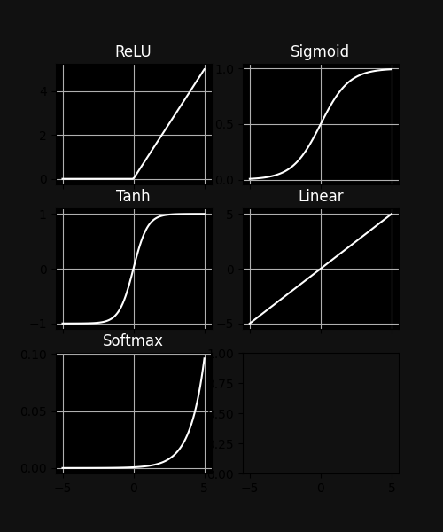

# NeuralNetworkFunctions
My own library for deep neural networks

## Files :

- ActivationFunctions.py
- DataClass.py
- LossFunctions.py
- NeuralNEtworkFunctions.py

****

### ActivationFunctions.py

This file contains all the built-in activation functions and their derivatives

***NOTE** : user defined functions can also be used but in the following format*

```python

def Function(input, '''any other parameters''', deriv = False): # input can be a numpy array
    if deriv:
        #derivative computation
        return ... #output
    else:
        #computation of your function
        return ... #output
```

Here is an example from the built-in functions

```python

def ReLU(vec, deriv = False):

    if deriv:
        return (vec > 0).astype(float)
    else:
        return np.maximum(0,vec)

```

**Built-in Functions**

- ReLU
- Sigmoid
- Tanh
- Linear
- Softmax (no derivative defined)

..... more to come :smiley:



***NOTE** : Softmax function here takes*
>xs = np.linspace(-5,5,100)

*as input* 

****

### DataClass.py

This is a module for ordering and batch division of data arrays

Data Class takes a data Array and relevant indexing info to split into train and test sets

the above sets can be further split into batches of desired sizes using the above sets can be further split into batches of desired sizes using 
>CreateBatches(batchSize)

Example code:

```python

'''the follwing dataArray has no meaning'''
dataArray = np.random.uniform(size = (10,5))
dataArray[:,0] = [1,6,7,5,8,4,5,5,9,0]

data = Data(dataArray=dataArray,labelEndsAt=0,trainDataSize=0.6,shuffle=True) #trainDataSize must be between 0 and 1

print('Train Data Generated \n',data.trainDataArray, end ='\n\n')
print('Test Data Generated \n',data.testDataArray, end ='\n\n')

data.CreateBatches(batchSize=2)

print('Train Batches \n', data.trainBatches , end = '\n\n')
print('Test Batches \n', data.testBatches , end = '\n\n')

print('first batch :')
print('labels :\n' ,data.GiveNextBatch()[0] , end = '\n\n')
print('data :\n' ,data.GiveNextBatch()[1] , end = '\n\n')

# data.ResetOrder() #can be used to reset the GiveNextBatch function

```

output

```python
Train Data Generated 
 [[4.         0.94691028 0.87898346 0.98097621 0.03783457]
  [6.         0.22667993 0.42951624 0.14455688 0.36658615]
  [5.         0.75521519 0.66264689 0.61813888 0.79727888]
  [0.         0.16869787 0.80049103 0.21502784 0.80444513]
  [1.         0.67394877 0.47852584 0.44649136 0.90967487]
  [8.         0.48133817 0.8844222  0.67705103 0.11116891]]

Test Data Generated 
 [[5.         0.47778123 0.38568351 0.30395304 0.40003714]
  [5.         0.13728685 0.95202279 0.83334651 0.29789569]
  [9.         0.13192928 0.2998153  0.36848944 0.80302551]
  [7.         0.92258828 0.07519145 0.96942291 0.44979878]]

Train Batches
 [[[4.0 0.9469102848470978 0.8789834610759302 0.9809762104167429 0.037834567636730765]
  [6.0 0.22667993299872868 0.42951623964049956 0.14455687913914994 0.36658615491844315]]

 [[5.0 0.755215192898754 0.6626468852612433 0.618138875215323 0.7972788764797927]
  [0.0 0.16869786560468758 0.8004910266279224 0.21502783576899043 0.8044451310200283]]

 [[1.0 0.6739487695611365 0.47852583652593517 0.4464913608627681 0.9096748738860593]
  [8.0 0.4813381743269095 0.884422202649031 0.6770510341745678 0.11116890548192238]]]

Test Batches
 [[[5.0 0.47778123252853655 0.3856835114672189 0.30395304369453924 0.40003714344133623]
  [5.0 0.13728684822320458 0.9520227945295754 0.8333465063683319 0.2978956872370164]]

 [[9.0 0.13192928209301402 0.29981530351154817 0.36848944157475694 0.8030255106792298]
  [7.0 0.9225882818196238 0.0751914530418627 0.969422909375115 0.4497987825521833]]]

first batch :
labels :
 [[4.0]
 [6.0]]

data :
 [[0.755215192898754 0.6626468852612433 0.618138875215323 0.7972788764797927]
 [0.16869786560468758 0.8004910266279224 0.21502783576899043 0.8044451310200283]]
  ```

To be added : csv, tsv and json data array input compatibility