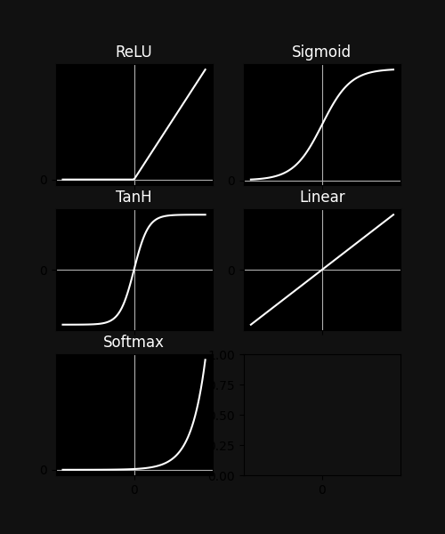

# NeuralNetworkFunctions
My own library for deep neural networks

## Files :

- ActivationFunctions.py
- DataClass.py
- LossFunctions.py
- NeuralNEtworkFunctions.py

****

### ActivationFunctions.py

This file contains all the built-in activation functions and their derivatives

***NOTE** : user defined functions can also be used but in the following format*

```python

def Function(input, '''any other parameters''', deriv = False): # input can be a numpy array
    if deriv:
        #derivative computation
        return ... #output
    else:
        #computation of your function
        return ... #output
```

Here is an example from the built-in functions

```python

def ReLU(vec, deriv = False):

    if deriv:
        return (vec > 0).astype(float)
    else:
        return np.maximum(0,vec)

```

**Built-in Functions**

- ReLU
- Sigmoid
- Tanh
- Linear
- Softmax (no derivative defined)

..... more to come :smiley:



***NOTE** : Softmax function here takes*
>xs = np.linspace(-5,5,100)

*as input* 

****

### DataClass.py

This is a module for ordering and batch division of data arrays

